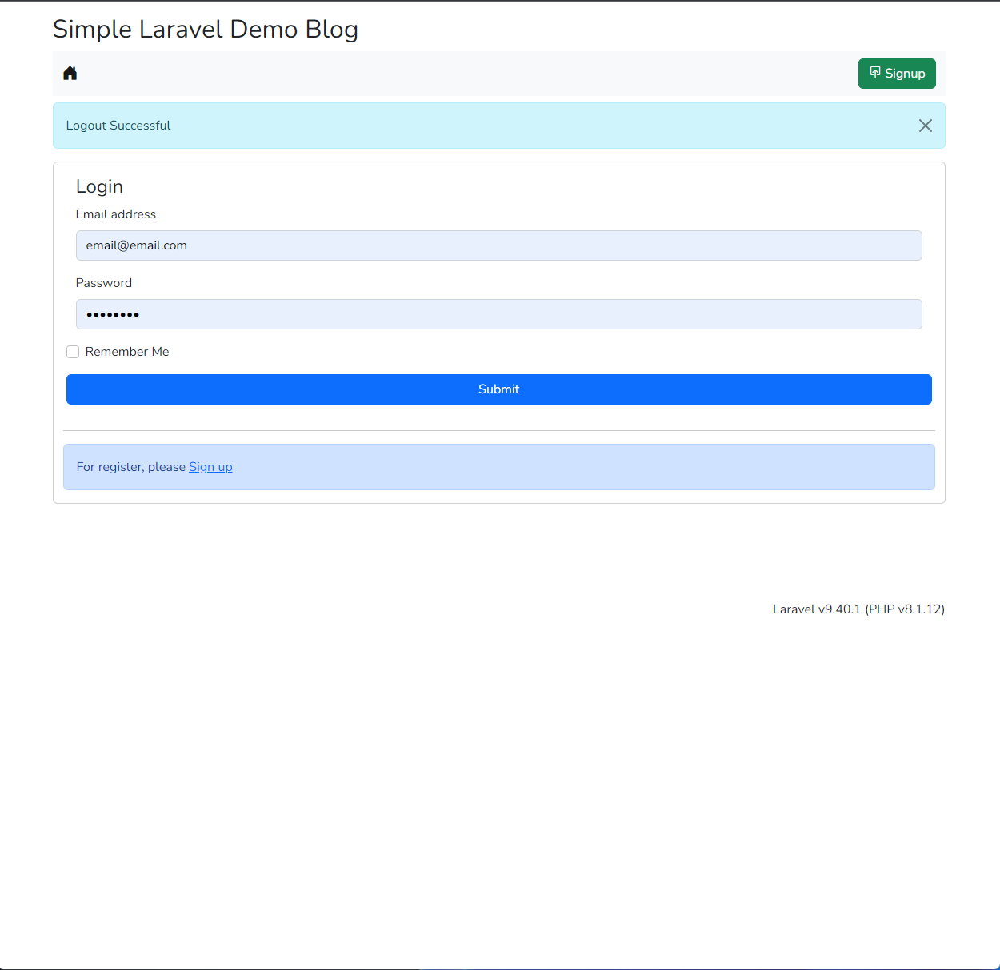
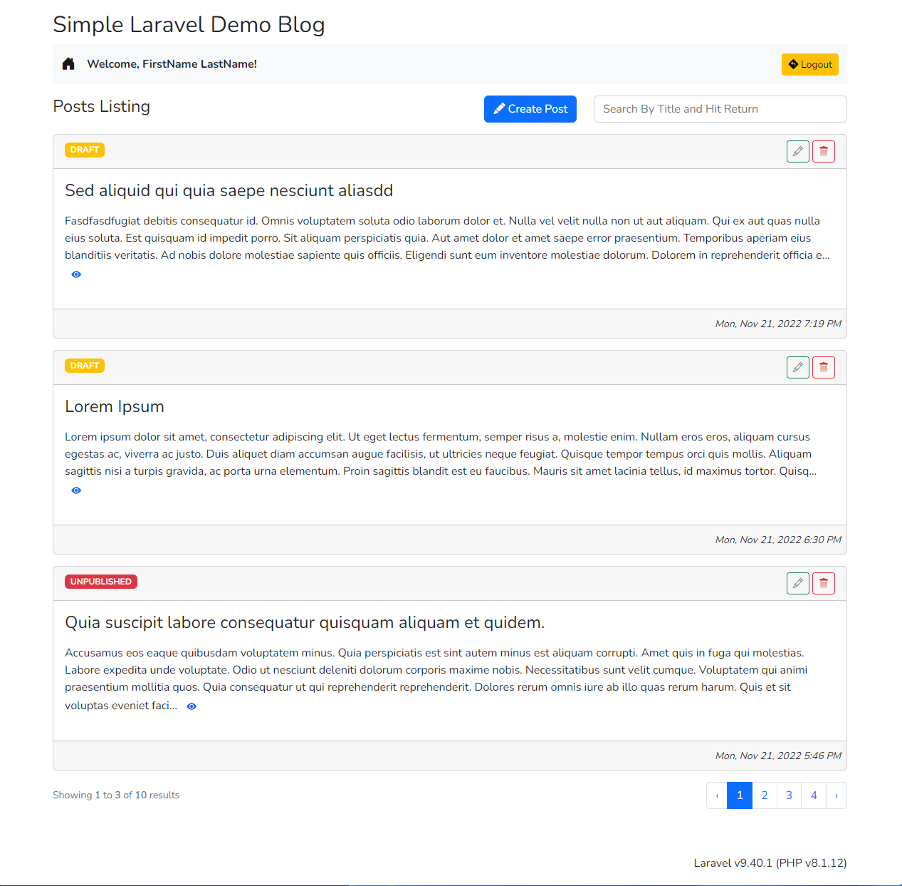
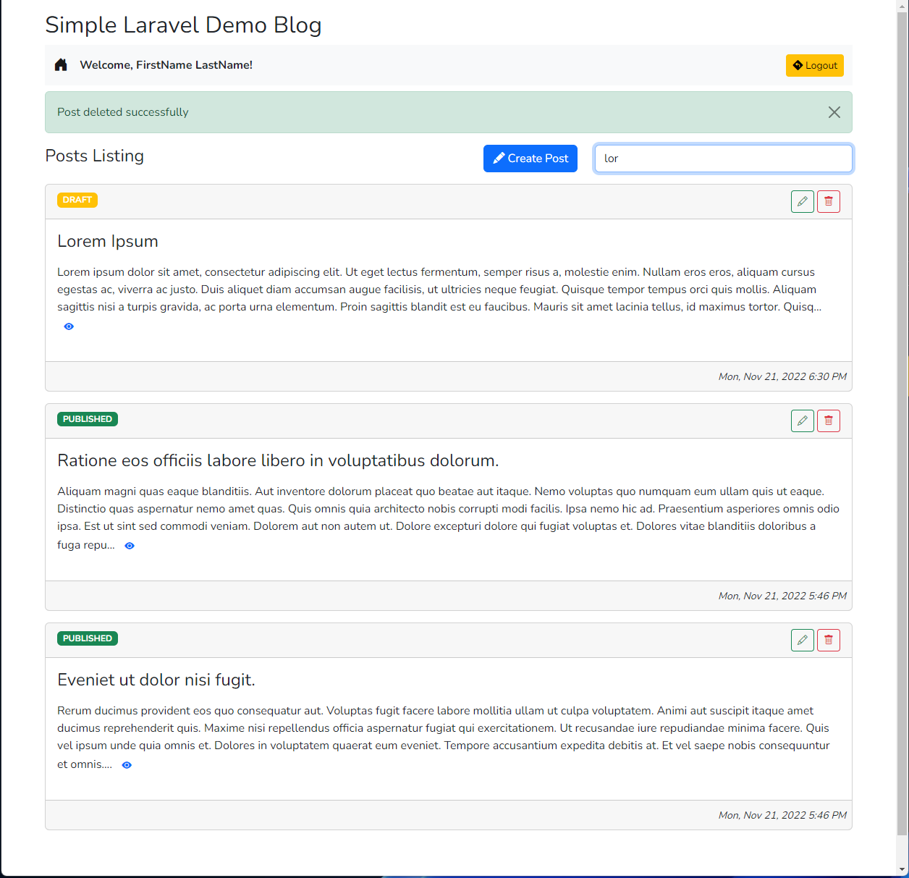
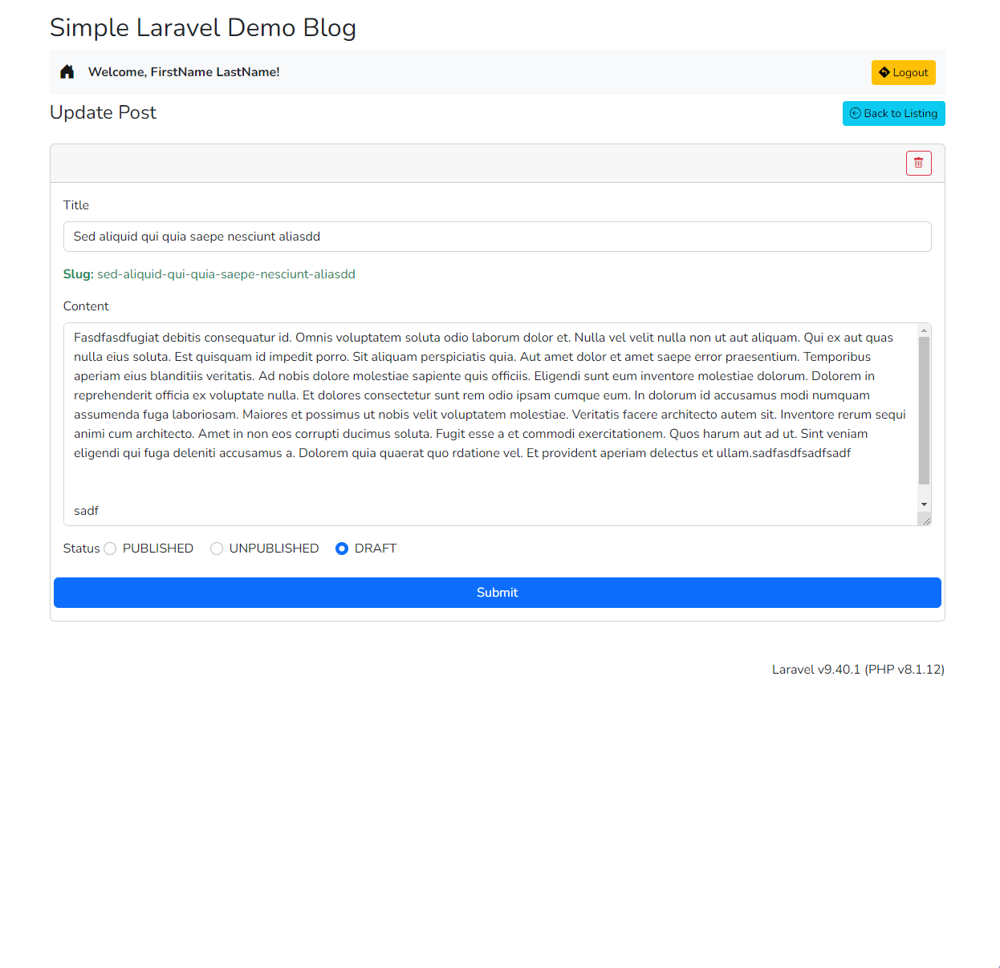
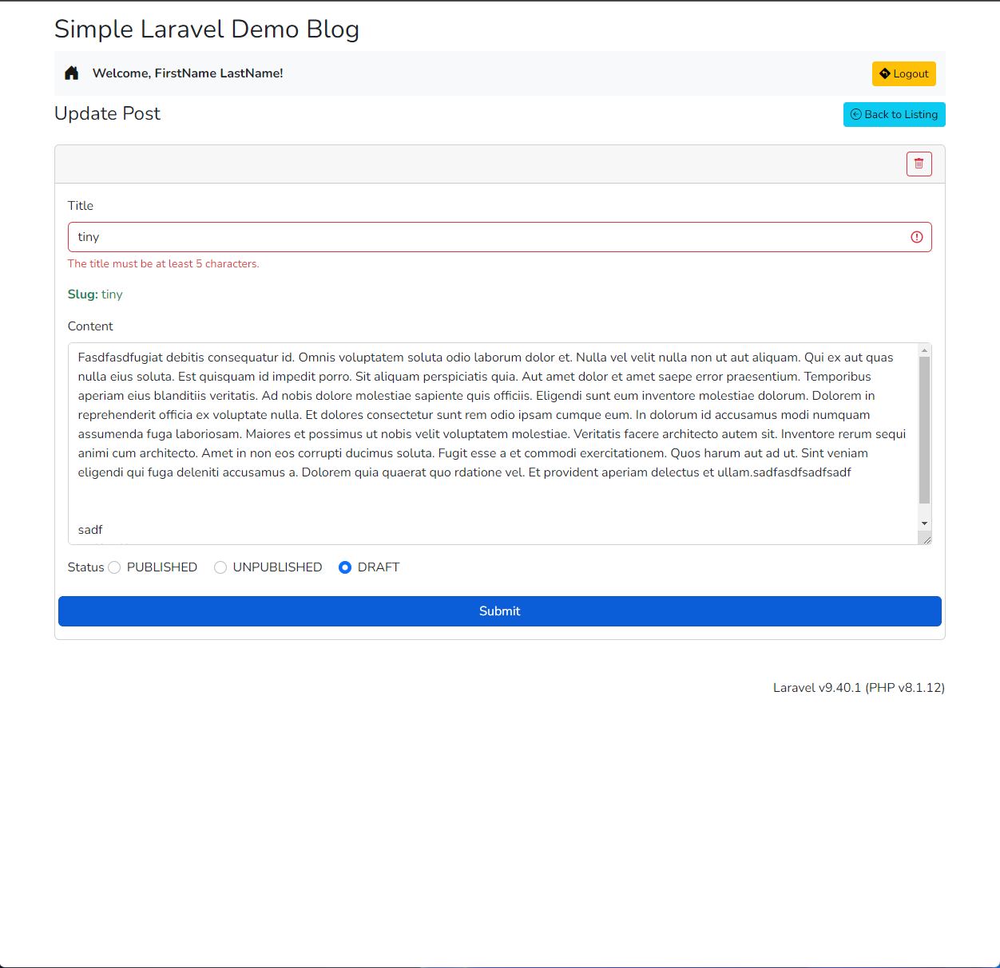
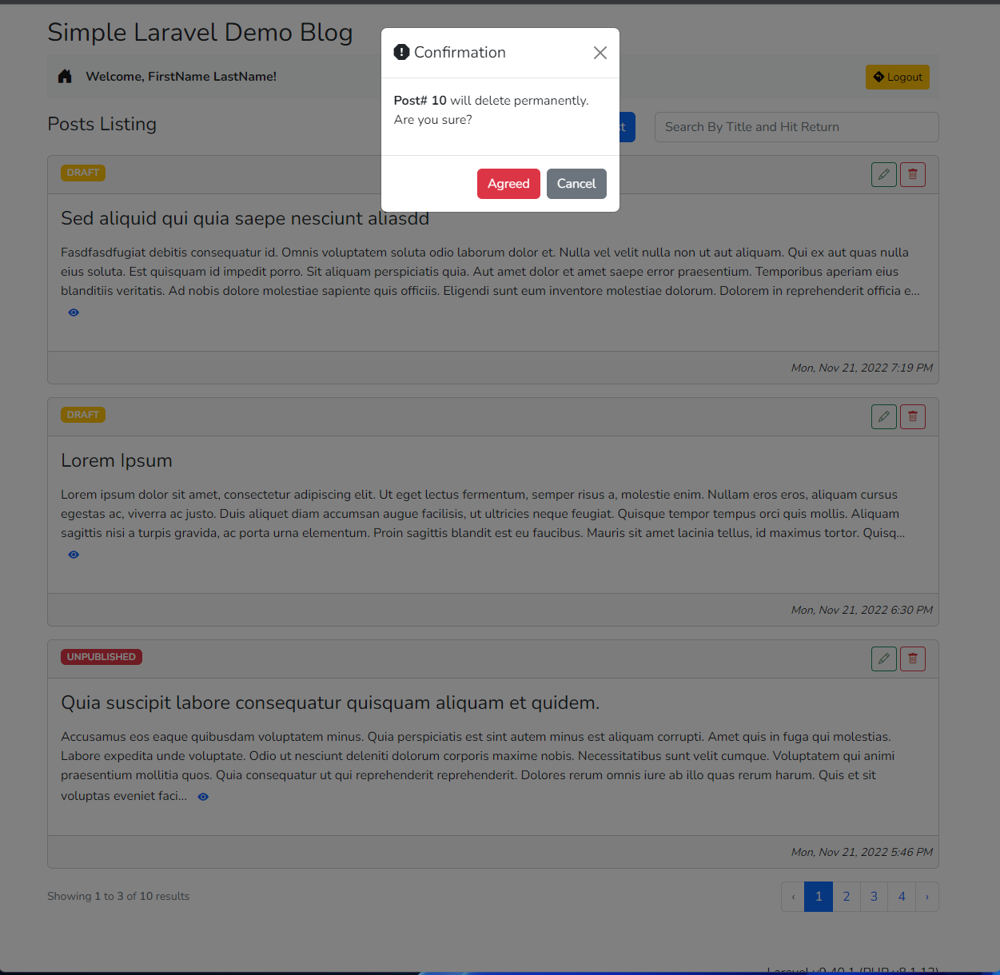

# Laravel/Livewire Simple Demo

### For Demo I've done two types of implementation

1.  Single Component `app/Http/Livewire/Posts.php`

2.  Multi Components `app/Http/Livewire/Post/{Create,Update,Listing,View}.php`

> In `web.php` route definition, Multi-component implementation is active now.
>
> Two check Single Component implementation, please just toggle comments.

---

## Authentication

For login please use `email@email.com / password` as credentials. Seeders already create the test user when run.

---

## Screenshots

## Login page

## Listing Page

## Listing Page w/ search

## Upsert Page (same view for create and edit)

## Upsert Page w/ validation

## Delete action (modal based)

